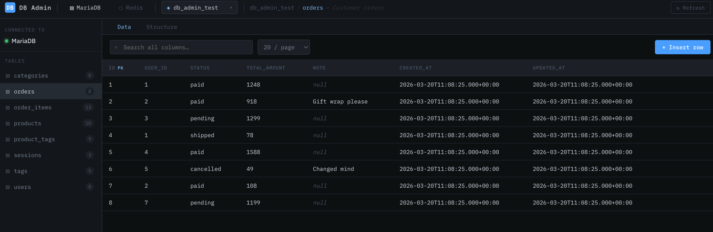
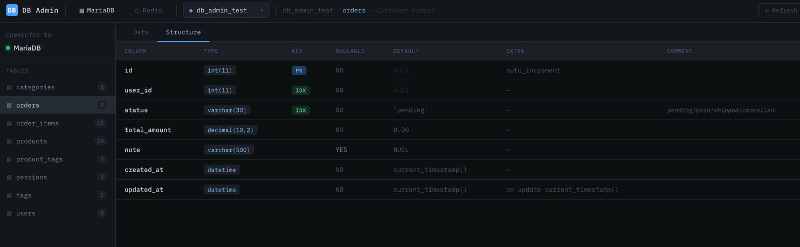
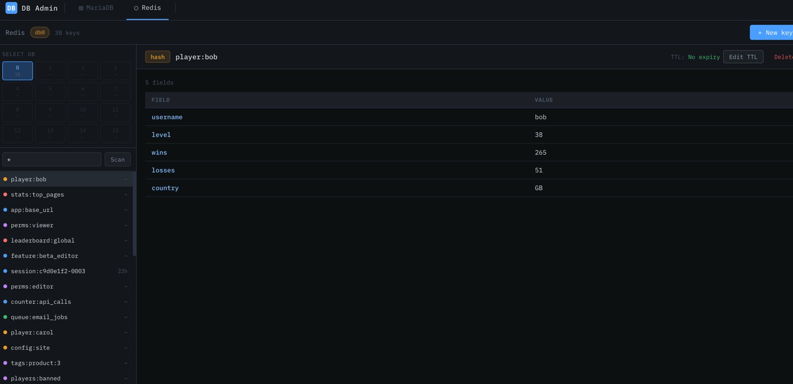

# OmniPanel

A lightweight, self-hosted omi panel built with **Spring Boot 3.5 + MyBatis-Plus** (backend) and **React 18 + Vite** (frontend).

Browse tables, view and edit data, and inspect Redis keys — all through your application's existing database connection, without needing direct DB access from your local machine.

---

## Screenshots

> **MariaDB — Data view**
> Browse tables across multiple schemas, search rows, paginate, and perform full CRUD operations.

> **MariaDB — Structure view**
> Inspect column types, primary keys, foreign keys, nullable flags, and comments.

> **Redis — Key browser**
> Switch between db0–db15, scan keys by pattern, and view values for all 5 Redis data types.


---

## Features

### MariaDB
- **Multi-schema support** — switch between multiple databases via a topbar dropdown
- **Table browser** — sidebar lists all tables with approximate row counts
- **Structure view** — column names, types, PK / FK / UNI badges, nullability, defaults, comments
- **Data view** — paginated rows (configurable page size: 10 / 20 / 50 / 100)
- **Global search** — real-time LIKE search across all text-compatible columns
- **Full CRUD** — insert, edit, and delete rows via modal forms
- **Safe by design** — table names validated against `information_schema`; blocked-table allowlist in config

### Redis
- **DB switcher** — 4×4 grid showing key count for each of db0–db15
- **Pattern scan** — SCAN with custom match patterns (`*`, `user:*`, `session:???`), with "load more" pagination
- **All 5 data types** — type-aware rendering for String, Hash, List, Set, and ZSet
- **TTL management** — view and edit TTL inline on any key
- **Key CRUD** — create keys of any type via a modal form, delete with confirmation
- **Key detail panel** — Hash displayed as a table, ZSet with scores, List/Set as indexed items

### Kafka
- **List topics & partitions**
- **View consumer groups & lag** 
- **Browse messages (from offset)**
- **Publish test messages**
- **Create / delete topics**
---

## Tech Stack

| Layer              | Technology                                   |
| ------------------ | -------------------------------------------- |
| Backend language   | Java 21                                      |
| Backend framework  | Spring Boot 3.5                              |
| ORM / SQL          | MyBatis-Plus 3.5.12                          |
| Redis client       | Lettuce (via spring-boot-starter-data-redis) |
| Database           | MariaDB 11.4                                 |
| Cache              | Redis 7.2                                    |
| Frontend framework | React 18 + Vite 6                            |
| HTTP client        | Axios                                        |
| Container          | Docker + Docker Compose                      |

---

## Project Structure

```
.
├── db-admin-backend/                   Spring Boot backend
│   ├── pom.xml
│   └── src/main/java/com/dbadmin/
│       ├── DbAdminApplication.java
│       ├── config/
│       │   ├── CorsConfig.java         CORS filter
│       │   ├── DbAdminProperties.java  Config binding (allowed schemas, blocked tables)
│       │   └── RedisAdminConfig.java   Lettuce RedisClient bean
│       ├── controller/
│       │   └── DbAdminController.java  MariaDB REST endpoints
│       ├── redis/
│       │   ├── controller/
│       │   │   └── RedisAdminController.java
│       │   ├── service/
│       │   │   └── RedisAdminService.java
│       │   └── model/
│       │       ├── RedisKeyInfo.java
│       │       ├── RedisKeyDetail.java
│       │       ├── RedisKeyPage.java
│       │       └── RedisUpsertRequest.java
│       ├── mapper/
│       │   └── DbAdminMapper.java      MyBatis mapper (dynamic multi-schema SQL)
│       ├── service/
│       │   └── DbAdminService.java
│       ├── model/
│       │   ├── request/RowRequest.java
│       │   └── response/               ApiResponse, TableInfo, ColumnMeta, PageResult
│       └── exception/
│           ├── AdminException.java
│           └── GlobalExceptionHandler.java
│
├── db-admin-frontend/                  React frontend
│   ├── vite.config.js                  Dev proxy → localhost:8080
│   └── src/
│       ├── App.jsx                     Root layout + MariaDB/Redis mode switcher
│       ├── index.css                   Dark theme (IBM Plex, CSS variables)
│       ├── services/
│       │   ├── api.js                  MariaDB API calls
│       │   └── redisApi.js             Redis API calls
│       ├── hooks/
│       │   └── useDebounce.js
│       └── components/
│           ├── Sidebar.jsx             Table list sidebar
│           ├── SchemaSelector.jsx      Schema dropdown
│           ├── DataView.jsx            Rows table + CRUD
│           ├── SchemaView.jsx          Column structure table
│           ├── RowModal.jsx            Insert / edit row form
│           ├── Pagination.jsx          Smart page controls
│           └── redis/
│               ├── RedisView.jsx       Redis page coordinator
│               ├── RedisDbSidebar.jsx  DB grid + key list
│               ├── RedisKeyPanel.jsx   Key detail + TTL + delete
│               └── RedisUpsertModal.jsx  Create key modal
│
├── docker-compose.yml                  MariaDB + Redis containers
├── seed_v2.sql                         MariaDB test data (3 schemas)
└── redis-seed.sh                       Redis test data (db0–db2)
```

---

## Getting Started

### Prerequisites

- Java 21+
- Maven 3.9+
- Node.js 18+
- Docker Desktop

### 1. Clone the repository

```bash
git clone https://github.com/Margaret-world/db-admin-panel.git
cd db-admin-panel
```

### 2. Start the databases

```bash
docker compose up -d

# Wait ~15 seconds for MariaDB to initialise (seed_v2.sql runs automatically)

# Load Redis test data
docker exec -i db-admin-redis sh < redis-seed.sh
```

Verify both containers are healthy:

```bash
docker compose ps
# Both should show STATUS: healthy
```

### 3. Run the backend

```bash
cd db-admin-backend
mvn spring-boot:run
# Server starts on http://localhost:8080
```

### 4. Run the frontend

```bash
cd db-admin-frontend
npm install
npm run dev
# Opens on http://localhost:3000
# All /api calls are proxied to the backend automatically
```

### 5. Open the panel

Visit **http://localhost:3000**

- Click **▤ MariaDB** to browse `db_admin_test`, `shop_db`, and `cms_db`
- Click **⬡ Redis** to explore the Redis key browser

---

## Configuration

### Backend — `application.yml`

```yaml
spring:
  datasource:
    url: jdbc:mariadb://localhost:3306/db_admin_test
    username: dbadmin
    password: dbadmin123

  redis:
    host: localhost
    port: 6379
    # password: yourpassword   # uncomment if Redis requires auth

db-admin:
  max-page-size: 200           # hard cap on rows per page

  # Tables never exposed via the API
  blocked-tables:
    - flyway_schema_history
    - DATABASECHANGELOG

  # Only these schemas appear in the UI dropdown
  # Leave empty to expose all schemas in the connected database
  allowed-schemas:
    - db_admin_test
    - shop_db
    - cms_db
```

### Docker ports

| Service | Host port | Container port |
|---|-----------|---|
| MariaDB | 3306      | 3306 |
| Redis | 6379      | 6379 |

MariaDB uses **3307** on the host to avoid conflicts with any local MySQL installation. Adjust in `docker-compose.yml` and `application.yml` as needed.

---

## API Reference

### MariaDB endpoints

| Method   | Endpoint                                                  | Description             |
| -------- | --------------------------------------------------------- | ----------------------- |
| `GET`    | `/api/admin/db/schemas`                                   | List allowed schemas    |
| `GET`    | `/api/admin/db/schemas/{schema}/tables`                   | List tables in a schema |
| `GET`    | `/api/admin/db/schemas/{schema}/tables/{table}/schema`    | Column definitions      |
| `GET`    | `/api/admin/db/schemas/{schema}/tables/{table}/rows`      | Paginated rows + search |
| `POST`   | `/api/admin/db/schemas/{schema}/tables/{table}/rows`      | Insert a row            |
| `PUT`    | `/api/admin/db/schemas/{schema}/tables/{table}/rows/{pk}` | Update a row            |
| `DELETE` | `/api/admin/db/schemas/{schema}/tables/{table}/rows/{pk}` | Delete a row            |

**Row query params:** `page`, `pageSize`, `search`

**Row request body:**

```json
{ "data": { "column_name": "value" } }
```

### Redis endpoints

| Method   | Endpoint                                  | Description                              |
| -------- | ----------------------------------------- | ---------------------------------------- |
| `GET`    | `/api/admin/redis/info`                   | Key count per DB (db0–db15)              |
| `GET`    | `/api/admin/redis/db/{db}/keys`           | SCAN keys (`pattern`, `cursor`, `count`) |
| `GET`    | `/api/admin/redis/db/{db}/keys/{key}`     | Full key detail + value                  |
| `POST`   | `/api/admin/redis/db/{db}/keys`           | Create or overwrite a key                |
| `PUT`    | `/api/admin/redis/db/{db}/keys/{key}/ttl` | Update TTL only                          |
| `DELETE` | `/api/admin/redis/db/{db}/keys/{key}`     | Delete a key                             |

---

## Production Deployment

### Build a single JAR with embedded frontend

```bash
# 1. Build the frontend
cd db-admin-frontend
npm run build

# 2. Copy into Spring Boot static resources
cp -r dist/* ../db-admin-backend/src/main/resources/static/

# 3. Build the JAR
cd ../db-admin-backend
mvn clean package -DskipTests

# 4. Run
java -jar target/db-admin-backend-1.0.0.jar
# Access at http://localhost:8080
```

### Environment variable overrides

```bash
java -jar target/db-admin-backend-1.0.0.jar \
  --spring.datasource.url=jdbc:mariadb://prod-host:3306/mydb \
  --spring.datasource.username=produser \
  --spring.datasource.password=prodpass \
  --spring.redis.host=prod-redis-host \
  --spring.redis.password=redispass
```

---

## Security Notes

> This panel ships **without authentication** by design (suitable for internal / local use only).

Before exposing to any network:

1. **Add Spring Security** — protect `/api/admin/**` with JWT or session auth
2. **Restrict by IP** — allowlist trusted IPs at the reverse-proxy level (Nginx / Caddy)
3. **Use the blocked-tables list** — keep sensitive tables out of the panel
4. **Disable the log** — remove `log-impl: StdOutImpl` from `application.yml` in production

---

## Docker Useful Commands

```bash
# Start everything
docker compose up -d

# Stop (data preserved)
docker compose stop

# View logs
docker compose logs -f

# Open a MariaDB shell
docker exec -it db-admin-mariadb mariadb -u dbadmin -pdbadmin123 db_admin_test

# Open a Redis CLI
docker exec -it db-admin-redis redis-cli

# Wipe all data and re-seed from scratch
docker compose down -v && docker compose up -d
docker exec -i db-admin-redis sh < redis-seed.sh
```

---

## License

MIT